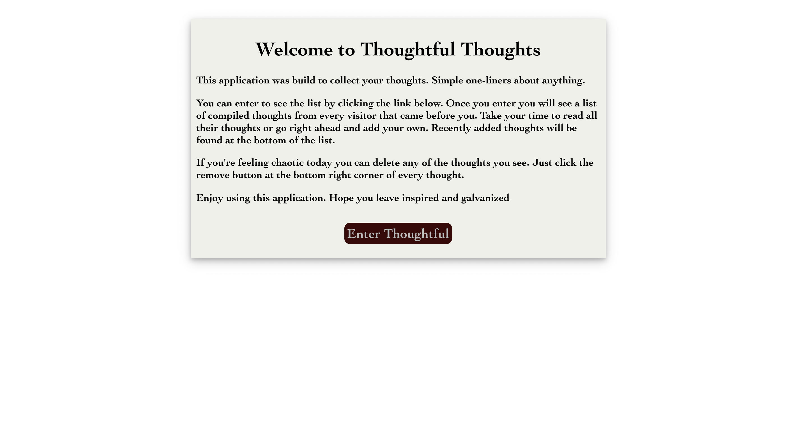
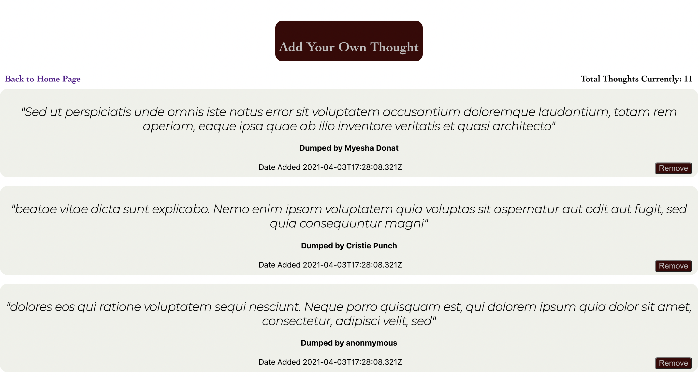
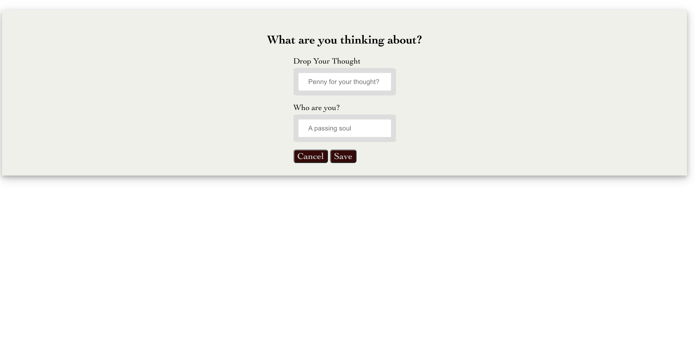

# Destination Diary Client

This project was bootstrapped with [Create React App](https://github.com/facebook/create-react-app).

Live application: [https://thoughtful-client-nishat322.vercel.app/](https://thoughtful-client-nishat322.vercel.app/)

API Repo: [https://github.com/Nishat322/thoughts-api](https://github.com/Nishat322/thoughts-api)

## User Story

Thoughtful allows users to see a list of thoughts submitted by any visitor to the webpage. The user first sees the landing page where they can use a button to enter the application. Once a user enters they see a list of thoughts and an option to add their own thought. Clicking on the add thoughts button leads to the add thoughts page where the user can submit their own thought.

### Landing Page

### Thoughts Page

### Add Thoughts Page

## Tech Stack

### Frontend
- ReactJS
- React Router
- CSS
- HTML
- Webpack
- Vercel

### Backend
- RESTful API
- Node
- Express
- Heroku

