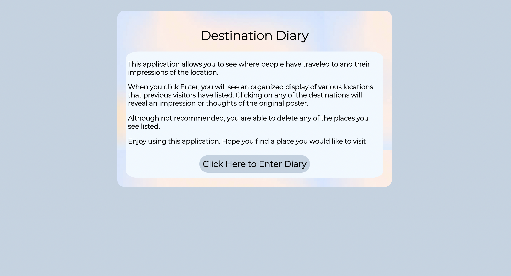
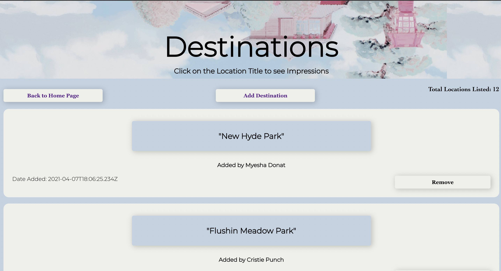
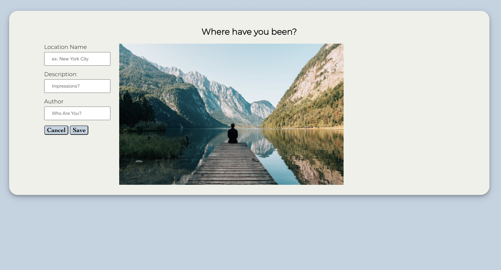

# Destination Diary Client

This project was bootstrapped with [Create React App](https://github.com/facebook/create-react-app).

Live application: [https://travel-client.vercel.app/](https://travel-client.vercel.app/)

API Repo: [https://github.com/Nishat322/travel-api](https://github.com/Nishat322/travel-api)

## User Story
Destination Diary allows users to catalog their travelling experience in one cohesive place. Users can use the application by clicking enter diary. Which leads them to a list of locations listed by previous visitors to the website. Users can add a location by clicking on the add location button. Users are also able to delete any location from the list by clicking on the remove button. 

### Landing Page

### Travel Page

### Add Travel Page

## Tech Stack

### Frontend
- ReactJS
- React Router
- CSS
- HTML
- Webpack
- Vercel

### Backend
- RESTful API
- Node
- Express
- Heroku

